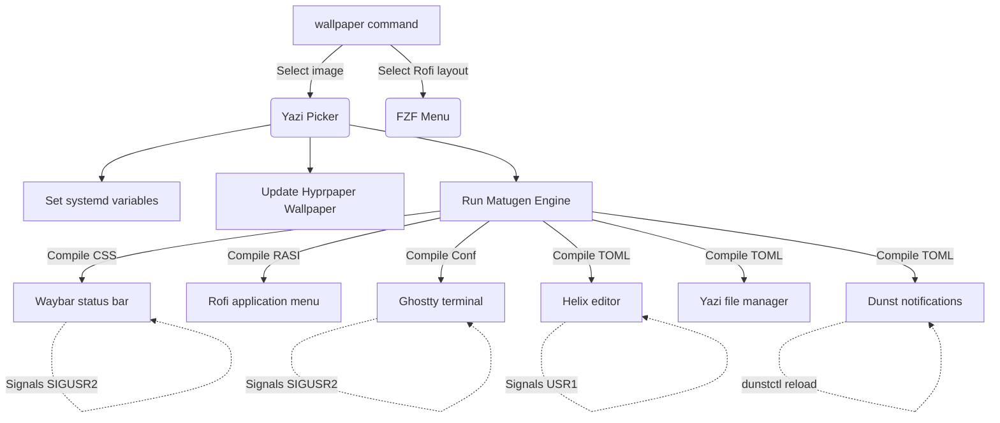

# Godod's Dotfiles

Personal configuration files (dotfiles) for modern terminal applications, developer environments, custom shell setups, and a dynamic tiling window manager workspace. Configured with a unified Material You design system and managed using [GNU Stow](https://www.gnu.org/software/stow/) for frictionless deployment.

---

## Gallery / Screenshots

### 🖥️ Main Desktop Window

*Hyprland dynamic workspace with custom Waybar status bar matching active wallpaper color accents.*

### 🚀 Application Launcher (Rofi) & Specs (Fastfetch)
| Rofi Application Selector | Rofi Theme Layout Variant | Fastfetch Specifications |
| :---: | :---: | :---: |
|  |  |  |

### 📝 Modal Text Editing (Helix)
| Helix Code Editing view | Helix Layout Buffers & Splits |
| :---: | :---: |
|  |  |

### 🎨 Dynamic Wallpaper selector (Fish)

*The `wallpaper` command inside Fish shell visualizes step completions and compiles configurations via Matugen.*

---

## Dynamic Color & Theming Architecture

This system features a **Dynamic Material You Color Pipeline** which extracts colors from your wallpaper and applies them across the system instantly:



### Dynamic Theming Workflow
1. Execute `wallpaper` inside the [Fish shell](file:///home/godod/.dotfiles/fish/.config/fish/README.md).
2. Choose an image from `~/Pictures/Wallpapers` inside a visual picker.
3. Select a Rofi configuration theme from FZF.
4. The script saves variables (`WALLPAPER_PATH`, `ROFI_THEME`) to the user environment, updates the background using `hyprpaper`, and triggers **Matugen**.
5. Matugen interpolates color templates and compiles stylesheets for active GUI/CLI programs.
6. Signals (`SIGUSR2`, `USR1`) trigger running programs to hot-reload styling options dynamically.

---

## Tech Stack & Core Applications

| Category | Application | Setup Description |
|---|---|---|
| **Shell** | [Fish Shell](file:///home/godod/.dotfiles/fish/.config/fish/README.md) | Modern interactive shell, Tide prompt, custom abbreviation aliases, and directory trackers. |
| **Editors** | [Helix](file:///home/godod/.dotfiles/helix/.config/helix/README.md) & [Neovim](file:///home/godod/.dotfiles/nvim/.config/nvim/README.md) | Post-modern modal configurations, custom lazygit buffers, formatting runners, and LSP attachments. |
| **Window Manager** | [Hyprland](file:///home/godod/.dotfiles/hypr/.config/hypr/README.md) | Programmatic tiling manager configured in modular Lua files with media bindings. |
| **Terminals** | [Ghostty](file:///home/godod/.dotfiles/ghostty/.config/ghostty/README.md) & [Kitty](file:///home/godod/.dotfiles/kitty/.config/kitty/README.md) | Blazing-fast GPU term layouts, font fallback structures, and cursor trail particle rendering. |
| **Notifications** | [Dunst](file:///home/godod/.dotfiles/dunst/.config/dunst/README.md) | Dynamic Material You notification daemon with Waybar history counts. |
| **File Manager** | [Yazi](file:///home/godod/.dotfiles/yazi/.config/yazi/README.md) | Terminal file explorer featuring responsive preview grids and custom theme files. |
| **Git Client** | [Lazygit](file:///home/godod/.dotfiles/lazygit/.config/lazygit/README.md) | Terminal Git GUI featuring custom AI-assisted commit message picker. |
| **Theme Compiler** | [Matugen](file:///home/godod/.dotfiles/matugen/.config/matugen/README.md) | Dynamic Material You color scheme generator and process signals hook. |

---

## Prerequisites

- **Shell**: `bash` >= 5.2 (required for native subshell evaluations)
- **Linux Packages installer**: Arch Linux environment with `yay` AUR helper configured.
- **macOS Packages installer**: macOS environment with `Homebrew` (brew) setup.

---

## How to Install

This section outlines the setup process, focusing on detailed instructions to install all necessary dependencies on Arch Linux.

### 1. Clone the Repository

Clone this dotfiles repository into your home directory:

```bash
git clone https://github.com/Godod/dotfiles.git ~/.dotfiles
cd ~/.dotfiles
```

### 2. Install Dependencies (Arch Linux)

You can provision all dependencies automatically using the included script or install them step-by-step manually.

#### Option A: Automated Installation (Recommended)

Simply execute the automated installer script [arch.sh](file:///home/godod/.dotfiles/installation/arch.sh). This script automatically installs all core and AUR package dependencies using `yay`, registers `fish` as your user shell, installs the shell plugins, and stows the configurations:

```bash
chmod +x ./installation/arch.sh
./installation/arch.sh
```

#### Option B: Manual Installation & Dependency Breakdown

If you prefer to configure your environment step-by-step, follow the manual instructions below:

##### A. Bootstrap an AUR Helper (`yay`)
Several essential components (such as `tpack-bin`, `dblab-bin`, `nls-bin`, and `sabiql`) reside in the Arch User Repository (AUR). If you do not have an AUR helper configured, install `yay`:

```bash
# Install development prerequisites
sudo pacman -S --needed git base-devel

# Clone, build and install yay
git clone https://aur.archlinux.org/yay.git /tmp/yay
cd /tmp/yay
makepkg -si

# Clean up
cd -
rm -rf /tmp/yay
```

##### B. Install Package Stack
Run the following command to download and build all system tools, editors, environments, and custom package dependencies:

```bash
yay -S git base-devel fish fisher fzf fd bat tmux neovim deno lazygit eza helix stow zoxide yazi bash tpack-bin fastfetch dblab-bin marksman lazydocker nls-bin sabiql
```

Here is a detailed breakdown of what each dependency is used for:

| Package | Source | Purpose / Integration |
| :--- | :---: | :--- |
| `git` | Official Repos | Core version control to sync dotfiles and track modifications. |
| `base-devel` | Official Repos | Basic compilation tools (`gcc`, `make`, etc.) required to build AUR helper modules. |
| `fish` | Official Repos | The primary interactive command shell featuring custom abbreviations and environment helpers. |
| `fisher` | Official Repos/AUR | Fish shell plugin manager. |
| `fzf` | Official Repos | Fuzzy finder utility integrated into shell navigations and selection menus. |
| `fd` | Official Repos | Rapid find replacement used for visual file indexing and menu completions. |
| `bat` | Official Repos | Syntax-highlighting reader for terminal configurations and file previewing. |
| `tmux` | Official Repos | Terminal multiplexer used to manage persistent workflow sessions. |
| `neovim` | Official Repos | Extensible text editor integrated with custom plugins. |
| `deno` | Official Repos | Secure runtime for JavaScript and TypeScript required by Markdown/YAML helper tooling. |
| `lazygit` | Official Repos | Terminal UI dashboard for quick Git staging, commits, and branch switching. |
| `eza` | Official Repos | Modern file listing engine used as a custom directory structure output helper. |
| `helix` | Official Repos | Post-modern modal text editor used as the main console code editing tool. |
| `stow` | Official Repos | GNU Stow to link folder configurations into `~/.config`. |
| `zoxide` | Official Repos | Smarter directory database tracking frequent directories (`cd` utility). |
| `yazi` | Official Repos | Terminal file manager with responsive preview grids and custom image render hooks. |
| `bash` | Official Repos | GNU Bourne Again SHell required for running terminal wallpaper pipelines. |
| `tpack-bin` | AUR | Binary version of Tmux Package Manager (TPM) used for session plugins. |
| `fastfetch` | Official Repos | Fast system diagnostics visualizer. |
| `dblab-bin` | AUR | Interactive database terminal client supporting multiple SQL drivers. |
| `marksman` | Official Repos | Markdown Language Server Protocol (LSP) provider. |
| `lazydocker` | Official Repos | Keyboard-driven terminal dashboard for Docker container tracking. |
| `nls-bin` | AUR | Modern directory lister utility used as the primary `ls`/`ll` alias command. |
| `sabiql` | AUR | Keyboard-driven SQL query executor. |

##### C. Register Fish and Change User Shell
Register the newly installed `fish` environment and set it as your default login shell:

```bash
# Add fish to shells listing
echo "/bin/fish" | sudo tee -a /etc/shells

# Update your user shell
chsh -s /bin/fish
```
> [!NOTE]
> Re-login or reload your terminal session for the default shell swap to take effect.

##### D. Install Fish Plugins
Bootstrap the fish terminal experience by running the plugins installer script [plugins.fish](file:///home/godod/.dotfiles/installation/plugins.fish):

```bash
fish ./installation/plugins.fish
```
This installs Tide prompt v6, FZF integrations, and bracket auto-pairing hooks.

##### E. Apply Configurations using Stow
Generate system symbolic links for all configurations (Helix, Neovim, Tmux, Fish, Ghostty, etc.) using [apply](file:///home/godod/.dotfiles/apply):

```bash
./apply
```

---

### 3. macOS Setup (Alternative)

For macOS environments, use [macos.sh](file:///home/godod/.dotfiles/installation/macos.sh) to provision packages via `Homebrew`:

```bash
chmod +x ./installation/macos.sh
./installation/macos.sh
```

### 4. Post-Installation Steps

- **Fish Prompt Setup**: Open a new shell instance and configure the Tide layout:
  ```fish
  tide configure
  ```
- **Tmux Plugins Setup**: Launch `tmux`, then install tmux packages via `tpack` by pressing `Ctrl + b` followed by `I` (capital I).

---

## Configuration Directories

Detailed READMEs for each component:

- **[Installation](file:///home/godod/.dotfiles/installation/README.md)**: Installer scripts for Arch and macOS packages, shell default set, and fisher.
- **[Fish Shell](file:///home/godod/.dotfiles/fish/.config/fish/README.md)**: Fish configurations, custom wallpaper scripts, custom abbreviations, zoxide integrations.
- **[Helix Editor](file:///home/godod/.dotfiles/helix/.config/helix/README.md)**: Post-modern modal editor settings, keymaps for lazygit/yazi buffers, formatter setup.
- **[Neovim](file:///home/godod/.dotfiles/nvim/.config/nvim/README.md)**: Lazy.nvim package loading, LSP configurations, custom remaps (Primeagen inspired).
- **[Tmux](file:///home/godod/.dotfiles/tmux/.config/tmux/README.md)**: Tmux multiplexer, `tpack` plugin configuration, pomodoro, tmux2k Catppuccin theme.
- **[Yazi](file:///home/godod/.dotfiles/yazi/.config/yazi/README.md)**: Fast terminal file manager, visual wrap settings, Material You theme template.
- **[Hyprland](file:///home/godod/.dotfiles/hypr/.config/hypr/README.md)**: Tiling Window Manager configured via Lua using the native `hl` API.
- **[Dunst Notifications](file:///home/godod/.dotfiles/dunst/.config/dunst/README.md)**: Dynamic notification daemon, Waybar connection templates, and urgency rules.
- **[Matugen](file:///home/godod/.dotfiles/matugen/.config/matugen/README.md)**: Color generation parameters and post-reload system signals.
- **[Rofi](file:///home/godod/.dotfiles/rofi/.config/rofi/README.md)**: Application finder and window switching menu configurations.
- **[Ghostty](file:///home/godod/.dotfiles/ghostty/.config/ghostty/README.md)**: GPU terminal settings, fonts, background opacity overrides.
- **[Kitty](file:///home/godod/.dotfiles/kitty/.config/kitty/README.md)**: Kitty terminal config with customized cursor trails and theme files.
- **[Lazygit](file:///home/godod/.dotfiles/lazygit/.config/lazygit/README.md)**: Git terminal view, including custom AI Conventional Commits generation hook.
- **[Fastfetch](file:///home/godod/.dotfiles/fastfetch/.config/fastfetch/README.md)**: Styled fetch interface listing system specifications and uptime values.
- **[Waybar](file:///home/godod/.dotfiles/waybar/.config/waybar/README.md)**: Customized status bar modules matching wallpapers.
