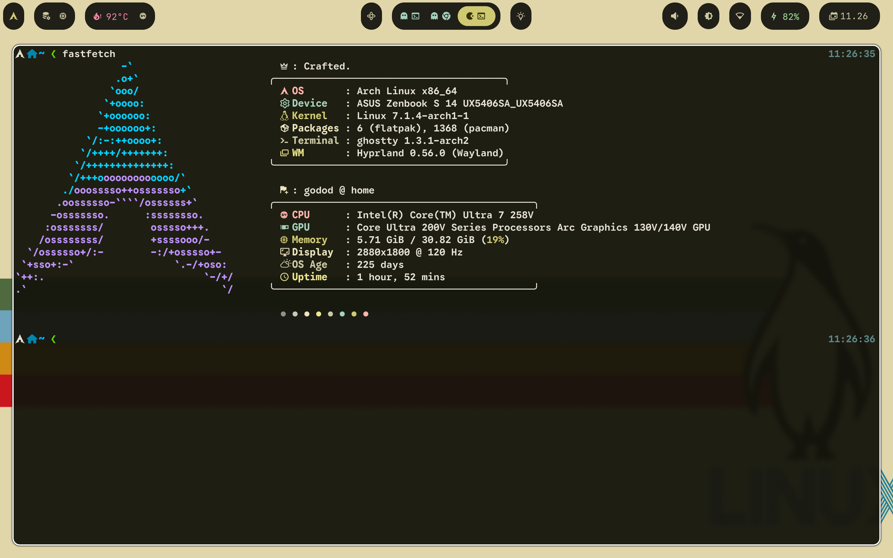
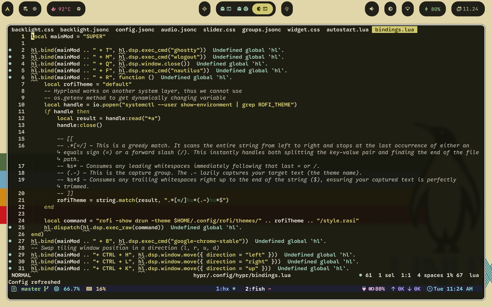
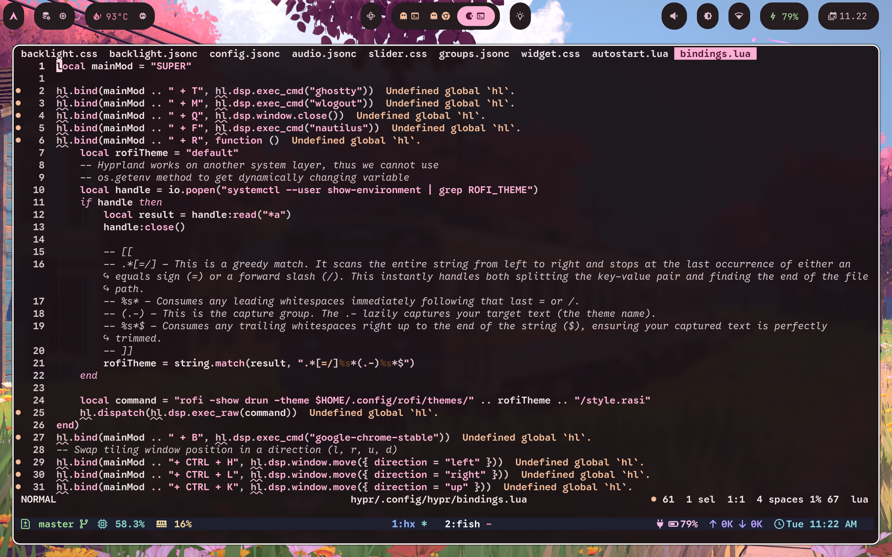
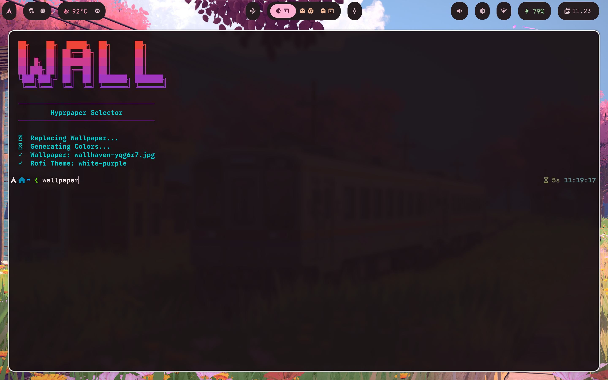
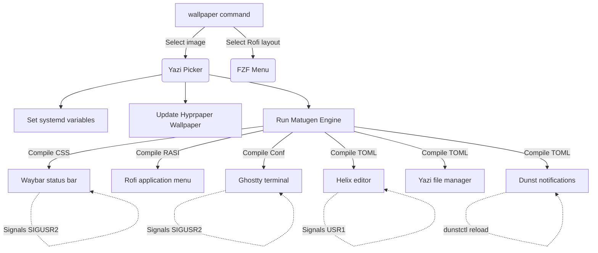

# Godod's Dotfiles

Personal configuration files (dotfiles) for modern terminal applications, developer environments, custom shell setups, and a dynamic tiling window manager workspace. Configured with a unified Material You design system and managed using [GNU Stow](https://www.gnu.org/software/stow/) for frictionless deployment.

---

## Gallery / Screenshots

### 🖥️ Main Desktop Window

*Hyprland dynamic workspace with custom Waybar status bar matching active wallpaper color accents.*

### 🚀 Application Launcher (Rofi) & Specs (Fastfetch)
| Rofi Application Selector | Rofi Theme Layout Variant | Fastfetch Specifications |
| :---: | :---: | :---: |
|  |  |  |

### 📝 Modal Text Editing (Helix)
| Helix Code Editing view | Helix Layout Buffers & Splits |
| :---: | :---: |
|  |  |

### 🎨 Dynamic Wallpaper selector (Fish)

*The `wallpaper` command inside Fish shell visualizes step completions and compiles configurations via Matugen.*

---

## Dynamic Color & Theming Architecture

This system features a **Dynamic Material You Color Pipeline** which extracts colors from your wallpaper and applies them across the system instantly:



### Dynamic Theming Workflow
1. Execute `wallpaper` inside the [Fish shell](file:///home/godod/.dotfiles/fish/.config/fish/README.md).
2. Choose an image from `~/Pictures/Wallpapers` inside a visual picker.
3. Select a Rofi configuration theme from FZF.
4. The script saves variables (`WALLPAPER_PATH`, `ROFI_THEME`) to the user environment, updates the background using `hyprpaper`, and triggers **Matugen**.
5. Matugen interpolates color templates and compiles stylesheets for active GUI/CLI programs.
6. Signals (`SIGUSR2`, `USR1`) trigger running programs to hot-reload styling options dynamically.

---

## Tech Stack & Core Applications

| Category | Application | Setup Description |
|---|---|---|
| **Shell** | [Fish Shell](file:///home/godod/.dotfiles/fish/.config/fish/README.md) | Modern interactive shell, Tide prompt, custom abbreviation aliases, and directory trackers. |
| **Editors** | [Helix](file:///home/godod/.dotfiles/helix/.config/helix/README.md) & [Neovim](file:///home/godod/.dotfiles/nvim/.config/nvim/README.md) | Post-modern modal configurations, custom lazygit buffers, formatting runners, and LSP attachments. |
| **Window Manager** | [Hyprland](file:///home/godod/.dotfiles/hypr/.config/hypr/README.md) | Programmatic tiling manager configured in modular Lua files with media bindings. |
| **Terminals** | [Ghostty](file:///home/godod/.dotfiles/ghostty/.config/ghostty/README.md) & [Kitty](file:///home/godod/.dotfiles/kitty/.config/kitty/README.md) | Blazing-fast GPU term layouts, font fallback structures, and cursor trail particle rendering. |
| **Notifications** | [Dunst](file:///home/godod/.dotfiles/dunst/.config/dunst/README.md) | Dynamic Material You notification daemon with Waybar history counts. |
| **File Manager** | [Yazi](file:///home/godod/.dotfiles/yazi/.config/yazi/README.md) | Terminal file explorer featuring responsive preview grids and custom theme files. |
| **Git Client** | [Lazygit](file:///home/godod/.dotfiles/lazygit/.config/lazygit/README.md) | Terminal Git GUI featuring custom AI-assisted commit message picker. |
| **Theme Compiler** | [Matugen](file:///home/godod/.dotfiles/matugen/.config/matugen/README.md) | Dynamic Material You color scheme generator and process signals hook. |

---

## Prerequisites

- **Shell**: `bash` >= 5.2 (required for native subshell evaluations)
- **Linux Packages installer**: Arch Linux environment with `yay` AUR helper configured.
- **macOS Packages installer**: macOS environment with `Homebrew` (brew) setup.

---

## Installation & Deployment

### 1. Clone the Repository
Clone this dotfiles repository into your home directory:

```bash
git clone https://github.com/Godod/dotfiles.git ~/.dotfiles
cd ~/.dotfiles
```

### 2. Run Provisioning Script
Provision your machine with required system tools:
- **Arch Linux**: Run [arch.sh](file:///home/godod/.dotfiles/installation/arch.sh)
  ```bash
  ./installation/arch.sh
  ```
- **macOS**: Run [macos.sh](file:///home/godod/.dotfiles/installation/macos.sh)
  ```bash
  ./installation/macos.sh
  ```

### 3. Stow Symlinks
Generate symbolic links from the dotfiles directory into your system's `~/.config` folder using the `./apply` helper script:

```bash
./apply
```

### 4. Post-Installation Steps
- **Fish Prompt**: Run `tide configure` inside your terminal to choose styling layout options.
- **Tmux Plugins**: Launch `tmux` and press `Ctrl + b` followed by `I` (capital I) to install tmux plugins via `tpack`.

---

## Configuration Directories

Detailed READMEs for each component:

- **[Installation](file:///home/godod/.dotfiles/installation/README.md)**: Installer scripts for Arch and macOS packages, shell default set, and fisher.
- **[Fish Shell](file:///home/godod/.dotfiles/fish/.config/fish/README.md)**: Fish configurations, custom wallpaper scripts, custom abbreviations, zoxide integrations.
- **[Helix Editor](file:///home/godod/.dotfiles/helix/.config/helix/README.md)**: Post-modern modal editor settings, keymaps for lazygit/yazi buffers, formatter setup.
- **[Neovim](file:///home/godod/.dotfiles/nvim/.config/nvim/README.md)**: Lazy.nvim package loading, LSP configurations, custom remaps (Primeagen inspired).
- **[Tmux](file:///home/godod/.dotfiles/tmux/.config/tmux/README.md)**: Tmux multiplexer, `tpack` plugin configuration, pomodoro, tmux2k Catppuccin theme.
- **[Yazi](file:///home/godod/.dotfiles/yazi/.config/yazi/README.md)**: Fast terminal file manager, visual wrap settings, Material You theme template.
- **[Hyprland](file:///home/godod/.dotfiles/hypr/.config/hypr/README.md)**: Tiling Window Manager configured via Lua using the native `hl` API.
- **[Dunst Notifications](file:///home/godod/.dotfiles/dunst/.config/dunst/README.md)**: Dynamic notification daemon, Waybar connection templates, and urgency rules.
- **[Matugen](file:///home/godod/.dotfiles/matugen/.config/matugen/README.md)**: Color generation parameters and post-reload system signals.
- **[Rofi](file:///home/godod/.dotfiles/rofi/.config/rofi/README.md)**: Application finder and window switching menu configurations.
- **[Ghostty](file:///home/godod/.dotfiles/ghostty/.config/ghostty/README.md)**: GPU terminal settings, fonts, background opacity overrides.
- **[Kitty](file:///home/godod/.dotfiles/kitty/.config/kitty/README.md)**: Kitty terminal config with customized cursor trails and theme files.
- **[Lazygit](file:///home/godod/.dotfiles/lazygit/.config/lazygit/README.md)**: Git terminal view, including custom AI Conventional Commits generation hook.
- **[Fastfetch](file:///home/godod/.dotfiles/fastfetch/.config/fastfetch/README.md)**: Styled fetch interface listing system specifications and uptime values.
- **[Waybar](file:///home/godod/.dotfiles/waybar/.config/waybar/README.md)**: Customized status bar modules matching wallpapers.
