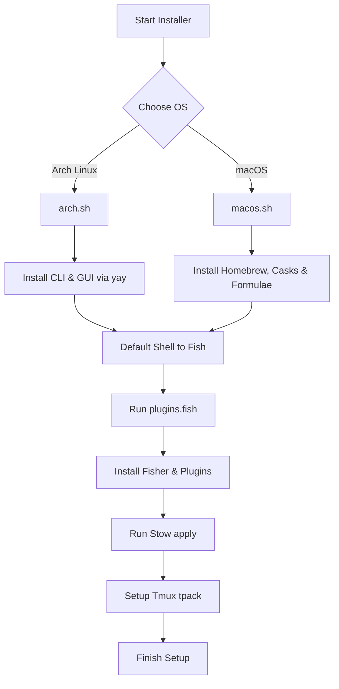

# Dotfiles Installation & Provisioning

A robust package provisioning and symlinking automation system designed to configure a fresh system (Arch Linux or macOS) with all the dotfiles configurations in minutes.

## Overview

The installation suite handles packages download, shell default registration, prompt configuration, and GNU Stow linking. It ensures that regardless of running on a local desktop or terminal server, the developer experience remains identical.

### Configuration Flow



---

## Tech Stack & Core Requirements

- **Linux Installer**: Arch Linux base, utilizes `yay` AUR helper.
- **macOS Installer**: Uses Apple Command Line Tools and `Homebrew` (brew).
- **Default Shell**: `fish` (v3.6+)
- **Symlink Management**: `stow` (GNU Stow)
- **Plugin Managers**: `fisher` (Fish shell plugins), `tpack` (Tmux package manager)

---

## Directory Structure

```
installation/
├── arch.sh            # Packages list and user setup for Arch Linux
├── macos.sh           # Formulae list and setup for macOS (Homebrew)
├── plugins.fish       # Automated Fisher bootstrap and plugins script
└── README.md          # Installation instructions
```

---

## Installation Guide

### Step 1: Pre-Installation
Ensure you have cloned this repository into your home folder:

```bash
git clone https://github.com/Godod/dotfiles.git ~/.dotfiles
cd ~/.dotfiles
```

### Step 2: Running Installer
Run the script corresponding to your operating system:

#### Arch Linux (requires AUR helper `yay`)
```bash
chmod +x installation/arch.sh
./installation/arch.sh
```

#### macOS (requires root elevation for shell change)
```bash
chmod +x installation/macos.sh
./installation/macos.sh
```

### Step 3: Symlink Configurations
To symlink all configurations to your `$HOME` directory, execute the `./apply` script:

```bash
chmod +x ./apply
./apply
```
*(This links components like `fish`, `ghostty`, `helix`, `nvim`, `tmux`, etc. into `~/.config/`)*

### Step 4: Post-Installation Bootstrapping
1. **Configure Fish Prompt**:
   Open a new terminal shell and run:
   ```fish
   tide configure
   ```
2. **Install Tmux Plugins**:
   Open a tmux session and trigger package downloads:
   `Ctrl + b` followed by `I` (capital I).

---

## Script Breakdown

### 1. `arch.sh`
- Installs GUI systems (Hyprland, Waybar, wlogout, Rofi, Dunst, Satty, Grim).
- Configures dev systems (Fish, Helix, Neovim, Tmux, Lazygit, Lazydocker, Zoxide).
- Registers fish shell to `/etc/shells` and performs `chsh -s`.

### 2. `macos.sh`
- Installs Homebrew if missing.
- Installs core developer casks (Ghostty, Google Chrome, etc.) and binaries (Helix, Neovim, Tmux, Stow, Zoxide, Bat).
- Adds fish shell to system shells listing and overrides local environment.

### 3. `plugins.fish`
Downloads Fisher and applies plugins listed in `fish_plugins`:
- `jorgebucaran/fisher` (Package Manager)
- `IlanCosman/tide@v6` (Prompt theme)
- `PatrickF1/fzf.fish` (FZF keybinds integration)
- `jorgebucaran/autopair.fish` (Auto-close brackets)

---

## Troubleshooting

### Stow Conflicts during link
If files already exist in your destination folder, Stow will abort with warnings:
```
WARNING: in conflict with local file: /home/user/.config/fish/config.fish
```
**Solution**: Backup or delete the existing file and re-run Stow:
```bash
# Remove default fish config if present
rm -rf ~/.config/fish/config.fish
# Apply links again
./apply
```

### Shell change fails on macOS
Under macOS, `chsh` might require password permissions or fails if fish is not listed:
```bash
# Verify path is added
cat /etc/shells | grep fish
# Manually apply switch
sudo chsh -s /opt/homebrew/bin/fish $USER
```

### Fisher command not found
If Fisher is not loaded when running fish shell for the first time, manually trigger the download:
```fish
curl -sL https://raw.githubusercontent.com/jorgebucaran/fisher/main/functions/fisher.fish | source && fisher install jorgebucaran/fisher
```
Then download plugins:
```fish
fisher install IlanCosman/tide@v6 PatrickF1/fzf.fish jorgebucaran/autopair.fish
```
