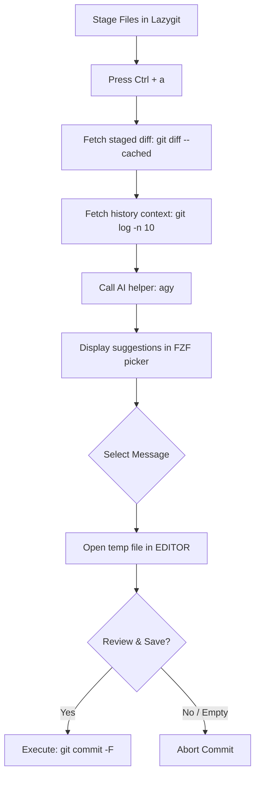

# Lazygit Configuration

A highly optimized configuration for the **Lazygit** terminal user interface, featuring layout parameters and a custom AI-assisted commit message generator.

## Overview

This configuration adds a custom tool shortcut to speed up day-to-day Git operations. By pressing `Ctrl + a` in the files panel, the system leverages local AI to write Conventional Commit messages matching the staged differences.

### Key Features

- **AI Commit Helper (`Ctrl + a`)**: Analyzes staged diffs and suggests 10 Conventional Commit messages.
- **Interactive Commit Picker**: Employs `fzf` to preview and pick one of the generated commit messages.
- **Review before Commit**: Automatically opens your preferred `$EDITOR` (e.g. Helix or Vim) containing the selected suggestion for a quick manual review before pushing.
- **Commit History Reference**: Feeds the last 10 repository commit messages to the AI engine, ensuring the generated output style aligns with the project's historical naming patterns.

---

## Tech Stack & Dependencies

- **Git GUI Client**: `lazygit` (v0.40.0+)
- **AI CLI Helper**: `agy` (an AI prompt command-line executor wrapper)
- **Fuzzy Finder**: `fzf` (used for selecting suggested commit messages)
- **Unix Utilities**: `xargs`, `mktemp`, `bash`

---

## Directory Structure

```
lazygit/
└── .config/
    └── lazygit/
        ├── config.yml      # Lazygit layout and custom command bindings
        └── README.md       # Configuration documentation
```

---

## The AI Commit Workflow (`Ctrl + a`)

Here is the exact step-by-step workflow triggered when you stage files and press `Ctrl + a` in the Lazygit files view:



### Detailed Prompt Strategy
The AI is instructed to follow strict guidelines:
1. **Format**: Every suggestion must follow the Conventional Commits specification: `<type>(<scope>): <description>`.
2. **Abstract Changes**: Instead of describing raw code edits line-by-line, the prompt forces the AI to summarize modifications at a high, structural level.
3. **No Spacing/Noise**: Outputs raw text to feed clean parameters to the `fzf` options list.

---

## Configuration Settings

The script is registered in `config.yml` under `customCommands`:

```yaml
customCommands:
  - key: <c-a>
    description: Pick AI commit
    command: "agy -p \"...\" | fzf --height 40% ... | xargs -I {} bash -c '...'"
    context: files
    output: terminal
```

---

## Troubleshooting

### Pressing `Ctrl + a` aborts with command not found errors
This feature relies on `agy` and `fzf`. Verify both packages are in your shell path:
```bash
which agy
which fzf
```
If `agy` is not installed, install it or replace it in `config.yml` with your preferred AI CLI utility (e.g. `sgpt` or standard API curls).

### Editor fails to open
If the editor window fails to boot when selecting a suggestion, check if the system environment variables are set:
```bash
echo $EDITOR
```
If `$EDITOR` is empty, Lazygit falls back to `vim`. Make sure your editor is declared in your shell configs (such as `fish/config.fish` or `zshrc`).
